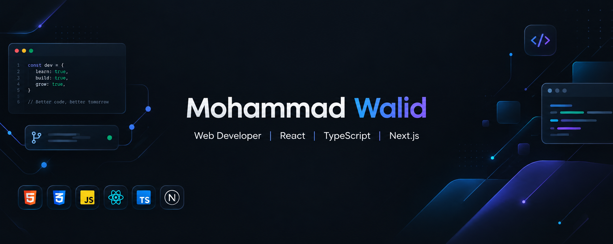

  

 

  

<h3 align="center">
  Aspiring Full-Stack Web Developer | Building, Learning & Growing 🚀
</h3>

  I'm a passionate web development learner focused on building modern,
  responsive, and user-friendly web applications.
  I enjoy learning by building real-world projects and continuously
  improving my development skills.

---

## 👨‍💻 About Me

- 🔭 I'm currently working on **full-stack web development projects**
- 🌱 I'm currently learning **Node.js, Express.js, MongoDB & backend development**
- 🤝 I'm looking to collaborate on **web development and open-source projects**
- 🆘 I'm looking for help with **backend development and best practices**
- 💬 Ask me about **HTML, CSS, JavaScript, React & Next.js**
- 📚 I enjoy learning new technologies by building real-world projects
- ⚡ Fun fact: **I learn best by building things and solving problems**

---

## 🛠️ Technologies & Tools

### Frontend

  

### Backend & Database

  

### Languages & Tools

  

---

## 🚀 Featured Projects

### 📚 Book Vibe

A modern book discovery and management application built with Next.js and TypeScript.

**Tech Stack:** Next.js · TypeScript · React · Tailwind CSS

🔗 **GitHub:** [Repository](https://github.com/walid573/Book-vibe)

🌐 **Live:** [Live Demo](https://book-vibe-cyan-chi.vercel.app/)

---

### 🧩 Dev Stack Builder

A web application that allows users to explore technologies and build their own development stack.

**Tech Stack:** React · TypeScript · Tailwind CSS

🔗 **GitHub:** [Repository](https://github.com/walid573/Assignment-05)

🌐 **Live:** [Live Demo](https://dev-stack-project1.netlify.app/)

---

## 📚 Currently Learning

- Node.js
- Express.js
- REST APIs
- MongoDB
- Authentication
- Backend Development
- Full-Stack Development

---

## 📊 GitHub Statistics

 
 

---

## 🤝 Connect With Me

  

  

---

  <i>💡 Learning. Building. Improving. One project at a time.</i>

 
